# Assembly
Note that your components may look slightly different, or you may have chosen different components.  For a description of what the miniMACRO5 is, [see the readme](README.md) where you can also find the [bill of materials](README.md#bill-of-materials-bom).  A list of required and useful equipment can be found in [the equipment list](EQUIPMENT.md).

## A note on hardware versions
The white circuit board in these photos is a version 3b board dated 03/15/2020.  There are minor differences between the v3 and v3b board and case but these instructions should still work for the most part.

Prior to the v3b case the miniMACRO5 was installed from the underside of the case.

## Tips
### Check you have all the parts
Before you start, check you have everything you require based on the [bill of materials](README.md##bill-of-materials-bom).  Checking early avoids frustration and disappointment.

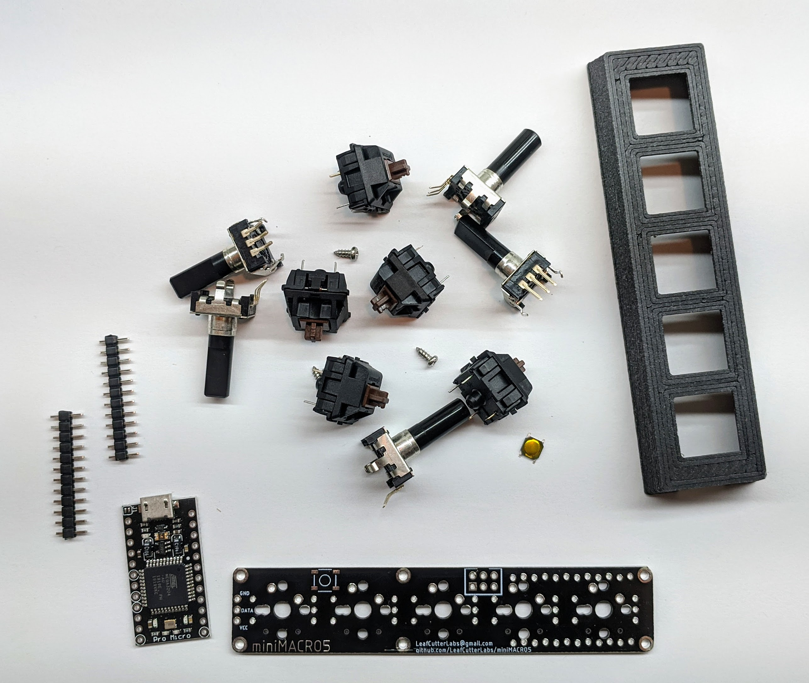

### Solder from low profile to high profile
Where possible it's best to solder from low profile (shortest) components to high profile (tallest).  For example starting with the reset switch, then headers.

Note that if using a rotary encoder (e.g. a Bourns PEC12R or PEC11R) these must be in place _before_ the Cherry switches.  The encoder cannot be inserted from the top of the plate (the plate must be placed over the top of the encoder) due to the connections being wider than switch holes in the plate.

## Where are components mounted?
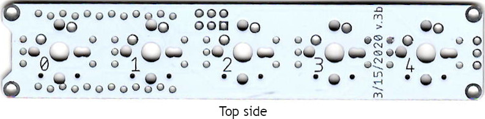

The _top side_ (above) of the miniMACRO5 is where the switches and encoders are mounted.  On this side of the board you'll see contacts and holes numbered 0 - 4.  Solder on the top side will be for the _ICSP header_ (optional), _MS2812b light strip_ (optional) and the _Arduino Pro Micro headers_.

The _underside_ (below), where you'll see the _miniMACRO5_ branding and the GitHub project address, is where the _ICSP header_ (optional), _reset button_ (optional) and _MS2812b light strip_ (optional) are mounted.  On the _underside_ you'll solder the encoders, switches and reset button.

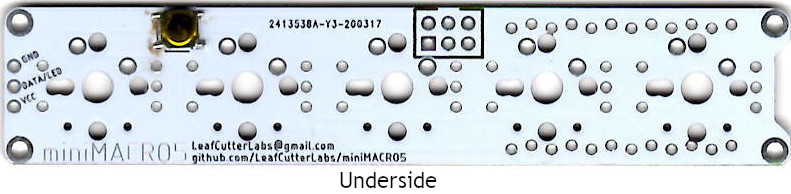

## Step 1 - Solder in the reset switch and ICSP ports
Solder the reset switch into place using the four pads on the underside of the board.  This is used to reboot the board in the event of problems.

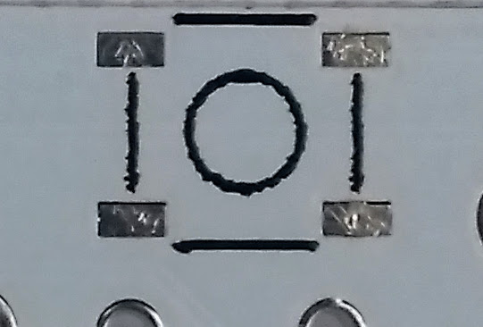

Next solder in the ICSP port (optional) if you need it.  The header is mounted on the underside of the board so your solder will be on the top side (where your key switches and encoder will be mounted).  There are six holes for the ICSP header, as below.

An ICSP header is only needed if the bootloader is not already installed on the Arduino Pro Micro.

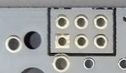

## Step 2 - Solder the Pro Micro Headers onto miniMACRO5
Mount the Pro Micro headers on the _underside_ of the board, trim additional length and solder in place on the top side.

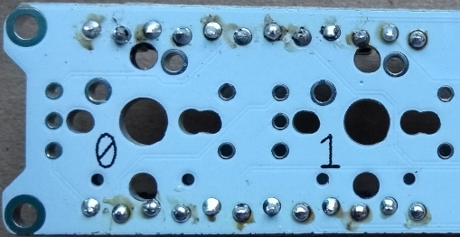

## Step 2a (optional) - Check for shorts
As the header has a lot of connections in a small space it it easy to create an accidental short circuit. You can check for electrical shorts by using a multimeter to test if any pins are connected together.  At this stage no pin should create a circuit with any other pin on the header.

If you find a short, remove the solder and redo the connection.

## Step 3 - Insulate the USB port
There is not much clearance between the micro USB socket and other components on the board.  Insulate the USB socket by covering it with tape (electrical insulation tape is best, although gaffa (duct tape) or selotape will also work).

## Step 4 - Add and solder rotary encoders
Install rotary encoders wherever you want them (the board supports up to five). The encoders will fit through the standard 14mm square plate hole for Cherry MX style switches.  On the image below, the pink holes are for the support legs (top and bottom), the two blue holes on the right are for the encoder's push button and the three yellow holes (left) are for the rotary encoder.  Note this photo is of the top side to show you how to insert the encoder, you _must_ solder on the underside.

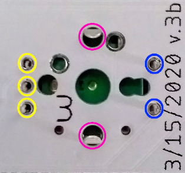

Once mounted the encoder will look like this:

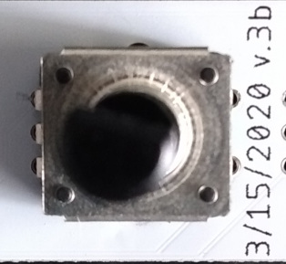

## Step 5 - Install switches and solder the switches
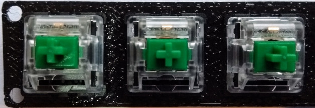

If using a version 3b case, press the switches into the plate until they click into place.  Then position the switches on the miniMACRO5 circuit board's _top side_.  The three pink holes (left to right) are for the stabiliser pegs while the two blue holes (above the legs) are for the copper pins.

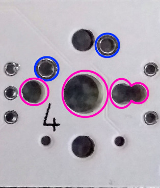

Solder each of the switches to the _underside_ of the board, making contact.

Prior to the v3b case there was no plate, so the switches were first soldered to the board, then mounted into the case from the underside as below:

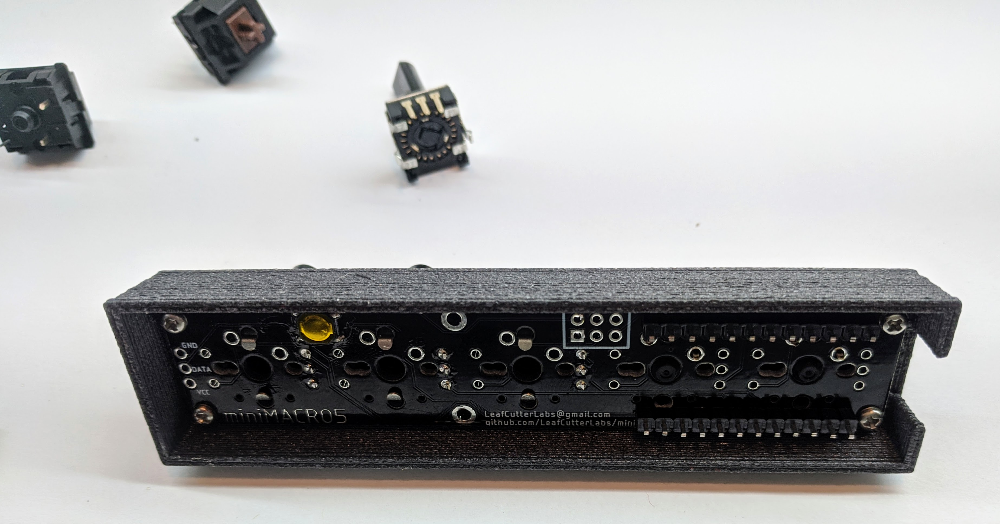

### A note on switches
Three and five pin Cherry MX and compatible switches (e.g. Gateron) are supported by the miniMACRO5.  A _three pin_ switch has two copper contacts and a central stabilisation peg.  _Five pin_ switches have two copper contacts, a central stabilisation peg and two side pegs.

Obviously we will only be soldering the copper contacts.

## Step 5a (optional) - Check for electrical continuity
Using a multimeter check for electrical continuity before soldering the Pro Micro into place.  There are connections under the Pro Micro and it is better to know if a repair is needed before soldering the Pro Micro into place!

## Step 6 (optional) - Solder RGB light strip
If using an RGB light strip (e.g. the MS2812b) solder that to the VCC/DATA/GND holes on the board.  The solder should be applied to the _top side_.

## Step 7 - Solder Pro Micro to Pro Micro Headers
Solder the Pro Micro to the _underside_ of the miniMACRO5 - the USB port is oriented up.  Note that if you're not using the v3b case you'll need to screw the miniMACRO5 into the case before soldering the Pro Micro in place.

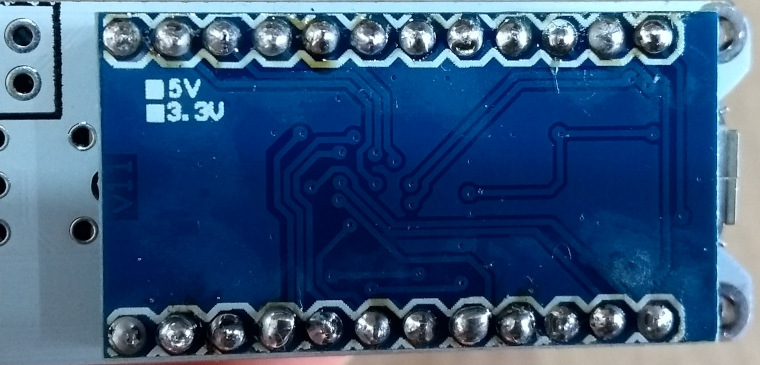

Your completed build should look similar to this:

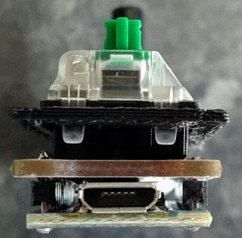

## Step 8 - Mount components into case
Lower the completed board into the v3b case.  The Arduino Pro Micro should fit between the supports (shown in pink) and the reset button should line up with the hole in the base.  Using M2 screws, secure the board into place.

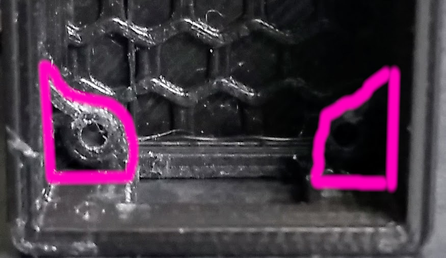

Add key caps and encoder knobs as required.

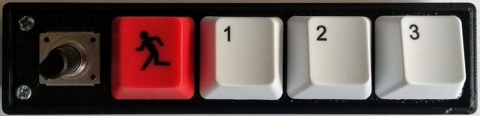
	
## Step 8 - Program with QMK
The miniMACRO5 runs the [QMK firmware](https://qmk.fm/).  See files at `/firmware/QMKv3/`.

## Step 9 - Enjoy!
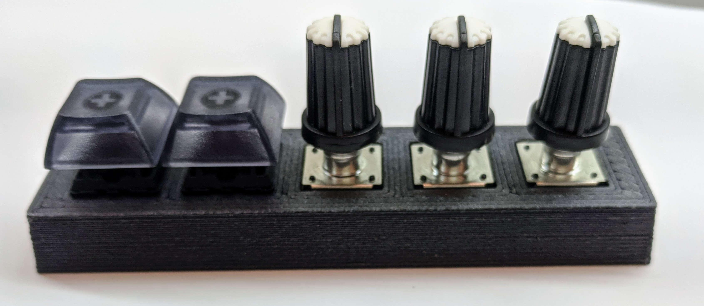

