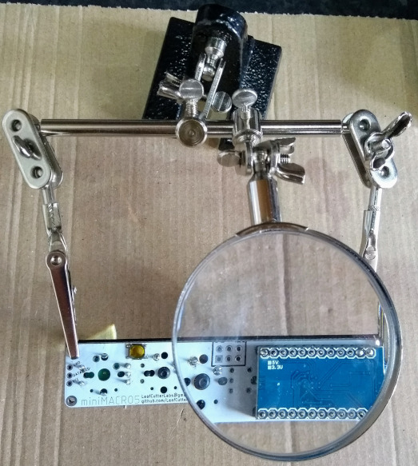

# Equipment
This list of equipment shows what's required to build this project, as well as what is useful.  There's also a [step by step assembly guide](ASSEMBLY.md).

## Required

* Soldering iron (and stand)
* Thin solder
* Solder sucker (for removing solder in the event of mistakes)
* Computer for programming the miniMACRO5 with the QMK firmware
* Micro USB to USB A cable for connecting the miniMACRO5 to the computer

## Optional

* Helping hands (crocodile clips for holding the board, often with a magnifying glass)
* Multimeter for testing connections
* Thin nosed wire cutters / tin snips (for trimming excess header length)

