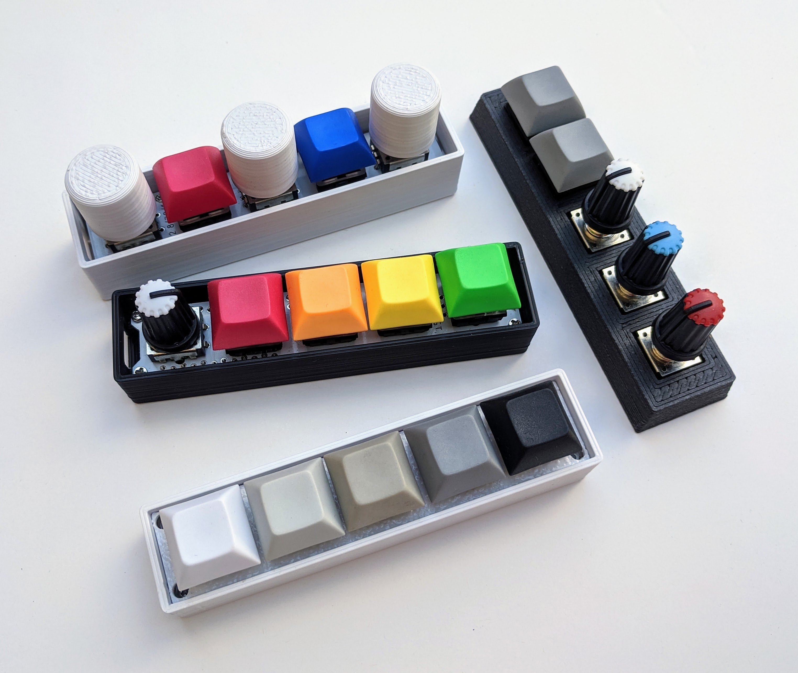

# miniMACRO5
QMK-powered macropad based on Arduino Pro Micro. Supports a mix of up to 5 rotary encoders or mechanical switches with optional RGB underglow.

 

## Bill of materials (BOM)
### Required components
1. Arduino Pro Micro with headers - available from SparkFun, eBay, Amazon, etc.
2. Rotary encoders - Bourns PEC12R and PEC11R, Alps, and the cheap Chinese versions have been tested. Any quadrature encocder that fits should work. Supports switch encoders.
3. Cherry MX-style switches
4. Keycaps for your chosen switches
5. Case (3d printable STL in `/hardware`)
6. 4x 4mm M2 mounting screws
7. Electrical insulation tape (if you do not have any, at this low voltage and current, regular clear tape will suffice)

### Optional components
1. Reset switch
2. ICSP headers (only required to flash the Arduino if the Caterina bootloader is not present)
3. WS2812 LED strip (for RGB underglow)

## Assembly instructions
[See ASSEMBLY.md](ASSEMBLY.md) for build instructions with photos.
